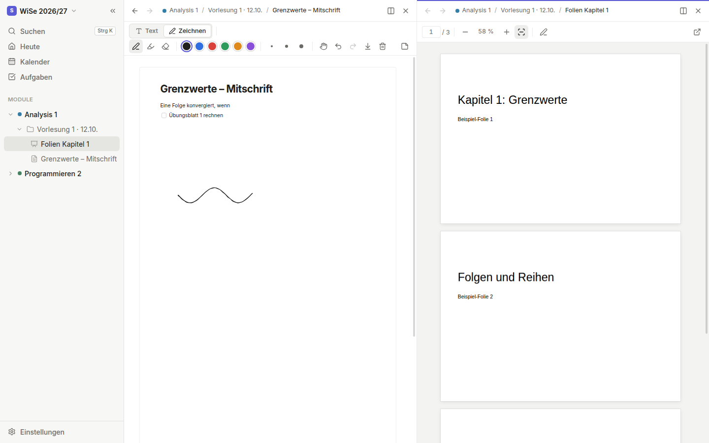
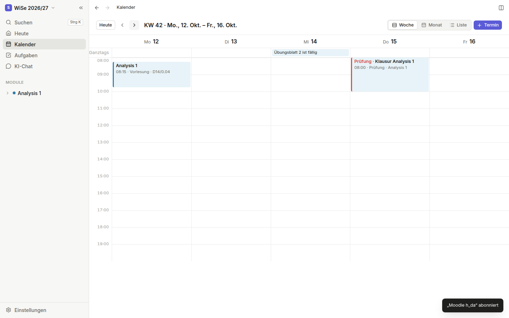
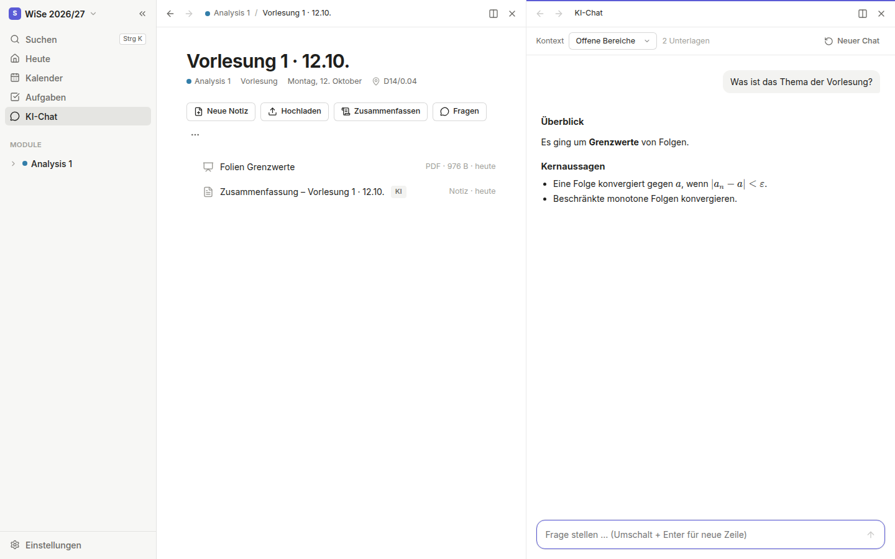

# Study Organizer

Ein ruhiger, minimalistischer Organizer fürs Studium: Semester, Module, Vorlesungen mit Raum, Praktika, Notizen mit Stift, Folien, Videos, Kalender – und optional KI mit deinem eigenen API-Key. Kein Konto, keine Cloud: Deine Daten bleiben auf deinem Rechner.



## Funktionen

**Studium organisieren**
- Ersteinrichtung beim ersten Start: Name, Hochschule, Studiengang, Semester, Module – ohne Login.
- Semesterzeiten sind für Universitäten, Hochschulen (HAW/FH) und die **h_da** hinterlegt. Beginnt ein neues Semester, fragt die App nach und übernimmt auf Wunsch Module.
- Module mit Kürzel, Dozent/in, ECTS, Farbe und **wöchentlichen Terminen inkl. Raum** (Vorlesung, Übung, Praktikum, Seminar, Tutorium; auch 14-täglich, mit Ausfällen und Weihnachtspause).
- **Ein Ordner pro Termin auf Knopfdruck** („Vorlesung 3 · 14.10.“) – darin landen Notizen, Folien, Fotos und Videos.
- **Praktikum**: eigene Termine, Testat-Status (bestanden/offen) und Abgaben pro Modul.
- **Aufgaben & Abgaben** mit Fälligkeit, gruppiert nach überfällig, heute, diese Woche …
- **Kalender** (Woche, Monat, Liste) zeigt automatisch alle Vorlesungen mit Raum, Prüfungen, Fristen und Praktika.

**Notizen wie auf dem Tablet**
- Editor im Notion-Stil mit Slash-Menü (`/`): Überschriften, Listen, Checklisten, Tabellen, Code, Zitate, **LaTeX-Formeln**, Bilder.
- Schriften (Sans, Serif, Buch, Mono, Handschrift, besonders gut lesbar), Größen, Farben, Textmarker.
- **Zeichnen mit Stift** (Druckstufen), Textmarker, Radierer; „Nur Stift zeichnet“ für Handballen-Erkennung.
- Papier: blanko, liniert, liniert mit Rand, kariert, Punktraster, Millimeter, Cornell – in Weiß, Creme, Grau oder Dunkel.

**Dateien**
- **PDF-Folien** ansehen, Text markieren und kopieren, **direkt auf die Folien schreiben**.
- **Videos und Audio** mit Geschwindigkeit 0,5× bis 3×, Sprüngen, Bild-in-Bild; die Position wird gemerkt.
- Fotos mit Zoom und Drehen, Textdateien, alles andere öffnet die Standard-App.
- **Split-Screen mit bis zu 4 Bereichen** – z. B. Folien, Übungsblatt, Notiz und KI-Chat gleichzeitig. `Strg`/`⌘` + Klick öffnet nebeneinander, oder Einträge aus der Seitenleiste in einen Bereich ziehen.

**Automatisch aktuell**
- **Moodle-Anbindung** (auch mit Hochschul-Login/SSO): Abgaben als Aufgaben, Tests und Kurstermine im Kalender, auf Wunsch Kursdateien.
- **Kalender-Abos (iCal)** von Moodle, Stud.IP, ILIAS, dem OBS der h_da-Informatik u. a. – regelmäßig abgeglichen.
- **Import von .ics-Dateien** für Systeme ohne Abo (my h_da/HISinOne, TUCaN).

**KI (optional)**
- Nur aktiv, wenn du sie in den Einstellungen einschaltest und einen API-Key hinterlegst.
- **Zusammenfassung einer Vorlesung**, **aller bisherigen Vorlesungen** eines Moduls oder **ausgewählter Dateien** – als neue Notiz.
- **Chat mit deinen Unterlagen**: Kontext sind die offenen Bereiche, ein Modul, ein Ordner oder eine Auswahl.
- Anbieter: **Groq, Hugging Face, Google Gemini, Mistral, OpenRouter** (kostenlos nutzbar), **OpenAI, Anthropic, DeepSeek, xAI**, lokal **Ollama/LM Studio** und jeder andere OpenAI-kompatible Dienst.

<p>
  
  
</p>

## Installation

Die fertigen Installationsdateien werden automatisch auf GitHub gebaut.

1. Öffne auf GitHub den Reiter **Releases** (fertige Versionen) – oder **Actions → „Installationspakete“ → neuester Lauf → Artifacts** (Stand des letzten Pushs).
2. Lade die Datei für dein System herunter.

### Windows (`.exe`)

1. `Study-Organizer-Setup-….exe` doppelklicken.
2. Warnt Windows SmartScreen („Der Computer wurde durch Windows geschützt“), auf **Weitere Informationen → Trotzdem ausführen** klicken. Die Warnung erscheint, weil die App nicht mit einem kostenpflichtigen Zertifikat signiert ist.
3. Installationsordner wählen → **Installieren**. Die App liegt danach im Startmenü und auf dem Desktop.

### macOS (`.dmg`)

1. `Study-Organizer-…-mac.dmg` öffnen und **Study Organizer** in den Ordner **Programme** ziehen.
2. Beim ersten Start meldet macOS „nicht verifizierter Entwickler“:
   - macOS 15 und neuer: **Systemeinstellungen → Datenschutz & Sicherheit** → ganz unten **Dennoch öffnen**.
   - Ältere Versionen: im Finder mit **Rechtsklick → Öffnen** starten.
3. Meldet macOS „ist beschädigt“, einmal im Terminal ausführen:
   ```bash
   xattr -cr "/Applications/Study Organizer.app"
   ```

Die `.dmg` enthält eine Universal-App (Apple Silicon und Intel).

### Linux (`.AppImage`)

```bash
chmod +x Study-Organizer-*.AppImage
./Study-Organizer-*.AppImage
```

### Wo liegen meine Daten?

| System | Ordner |
|---|---|
| Windows | `%APPDATA%\Study Organizer\data` |
| macOS | `~/Library/Application Support/Study Organizer/data` |
| Linux | `~/.config/Study Organizer/data` |

In **Einstellungen → Daten & Backup** kannst du den Ordner öffnen und ein Backup erstellen (z. B. auf einen USB-Stick). API-Keys und Moodle-Zugang liegen verschlüsselt im Schlüsselbund des Systems und sind nicht im Backup.

## KI einrichten (Beispiel Groq, kostenlos)

1. Auf [console.groq.com/keys](https://console.groq.com/keys) anmelden und **Create API Key** klicken, Key kopieren.
2. In der App: **Einstellungen → KI → Aktivieren**, Dienst **Groq**, Key einfügen, **Speichern**.
3. **Testen** klicken. Fertig – in jedem Vorlesungsordner gibt es jetzt **Zusammenfassen** und **Fragen**.

Andere Anbieter funktionieren genauso; unter „Modell“ lädt **Modelle laden** die verfügbaren Modelle. Datenschutz: Bei einer Zusammenfassung werden die gewählten Notizen und Folientexte an den Anbieter gesendet. Mit Ollama bleibt alles auf deinem Rechner.

## Moodle und Hochschulkalender

Kurzfassung (Details und Quellen in [docs/integrationen.md](docs/integrationen.md)):

- **Moodle verbinden**: Einstellungen → Moodle & Kalender-Abos → Adresse eingeben (z. B. `lernen.h-da.de`). Die App erkennt selbst, ob Benutzername/Passwort oder der Hochschul-Login (SSO) nötig ist. Danach Kurse den Modulen zuordnen und **Jetzt abgleichen**.
- **Moodle-Kalender abonnieren**: In Moodle Kalender → „Import und Export“ → „Kalender exportieren“ → „Alle Termine“ → „Kalender-URL abfragen“ → URL in der App unter „Kalender abonnieren“ einfügen.
- **my h_da**: Stundenplan → „Daten für Kalender (ics) exportieren“ → in der App **iCal-Datei importieren**.

## Entwicklung

Voraussetzung: [Node.js 22](https://nodejs.org) und [Git](https://git-scm.com).

```bash
# 1. Projekt holen
git clone https://github.com/souf1001/Study-Organizer.git
cd Study-Organizer

# 2. Abhängigkeiten installieren (lädt auch Electron herunter)
npm install

# 3. App im Entwicklungsmodus starten (lädt bei Änderungen automatisch neu)
npm run dev
```

Weitere Befehle:

| Befehl | Was er macht |
|---|---|
| `npm run lint` | Prüft den Code auf typische Fehler (ESLint) |
| `npm run typecheck` | Prüft die TypeScript-Typen |
| `npm test` | Unit-Tests (Vitest): Semester, Stundenplan, Speicher, iCal, Moodle |
| `npm run build` | Baut die App nach `out/` |
| `npm run test:e2e` | Startet die echte App und klickt die wichtigsten Abläufe durch (Playwright); unter Linux ohne Bildschirm: `xvfb-run -a npm run test:e2e` |
| `npm run dist:win` / `dist:mac` / `dist:linux` | Baut die Installationsdatei für das jeweilige System nach `release/` |

**Neue Version veröffentlichen:** Version in `package.json` erhöhen, committen, dann

```bash
git tag v0.2.0
git push origin v0.2.0
```

GitHub baut daraufhin `.exe`, `.dmg` und `.AppImage` und legt ein Release an.

### Aufbau des Codes

```
src/
  shared/     Datentypen und reine Logik (Semester, Stundenplan, KI-Anbieter) – ohne Abhängigkeiten
  backend/    Speicher (JSON + Dateien), KI-Aufrufe, iCal, Moodle – läuft in Node.js
  main/       Electron-Hauptprozess: Fenster, sichere IPC, Datei-Protokoll, Schlüsselbund, Moodle-SSO
  preload/    Brücke zur Oberfläche (window.studyApi, siehe shared/api.ts)
  renderer/   Oberfläche mit React
    src/lib/     Datenzugriff, Arbeitsfläche (Split-Screen), Aktionen, KI-Kontext
    src/shell/   Seitenleiste, Bereiche, Befehlspalette
    src/views/   Ansichten: Heute, Kalender, Aufgaben, Modul, Ordner, Notiz, Dateien, Chat, Einstellungen
    src/ui/      Grundbausteine: Buttons, Felder, Dialoge, Menüs
tests/        Unit-Tests und End-to-End-Tests
```

Grundprinzip: Die Oberfläche spricht nur über die Schnittstelle in `src/shared/api.ts` mit den Daten. Die Desktop-App setzt sie per IPC um, die Web-Version (Branch `webapp`) per HTTP – die Oberfläche bleibt dieselbe.

### Sicherheit

- Oberfläche in einer Sandbox ohne Node.js-Zugriff (`contextIsolation`, `sandbox`), strenge Content-Security-Policy.
- IPC nimmt nur Anfragen aus der eigenen Oberfläche an; IDs und Dateinamen werden gegen Pfad-Tricks geprüft.
- KI-Antworten werden vor der Anzeige bereinigt (DOMPurify).
- API-Keys, Moodle-Token und Kalender-Abo-Adressen werden mit dem Schlüsselbund des Systems verschlüsselt (Electron `safeStorage`).
- Links öffnen immer im Browser, nie im App-Fenster.

## Lizenz

MIT
